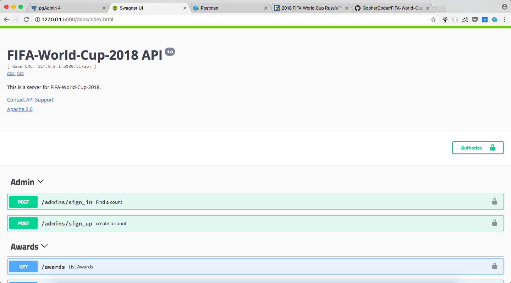
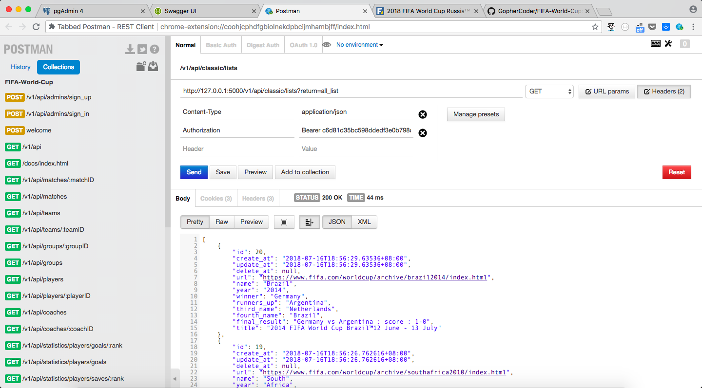

## FIFA WORLD CUP 2018

### 1. URL

- https://www.fifa.com/worldcup/

### 2. API

- MATCHES  比赛信息
- TEAMS  球队信息
- GROUPS  小组赛信息
- PLAYERS 球员信息
- STATISTICS 球员和球队数据信息
- AWARDS 奖项信息
- CLASSIC 往届世界杯信息

### 3. Usage 

0. 配置用户信息：数据库信息
1. 抓取数据
2. 建立数据库表
3. 同步到 postgreSQL 数据库中
4. fresh 启动 gin http  API  服务并监听变动
5. 自动生成 swagger 文档 
5. 调用各 API

---

- make install 

安装项目依赖库

- make dev 

启动web server

### 4. 技术

- gin: Web Server
- gorm: 数据库操作
- goquery: 网页解析
- gin-swagger \ swag:  构建 Swagger API
- fresh: 启动并监听 Web Server
- viper: 读取用户配置信息

----

数据库： postgres

可视化工具：

- pgAdmin
- DataGrip

----

API : 

- POSTMAN

### 5. 截图

### 6. 数据

抓取有困难，或者存在问题的，可以使用 db/fifaworldcup.sql 导入数据库

### 7. 视频版

[网易云课堂](http://study.163.com/course/courseMain.htm?courseId=1005784012&share=2&shareId=1026591096)

不喜欢视频就看源代码，有问题，我也会解答。

微信：wu_xiaoshen

## Stargazers over time

